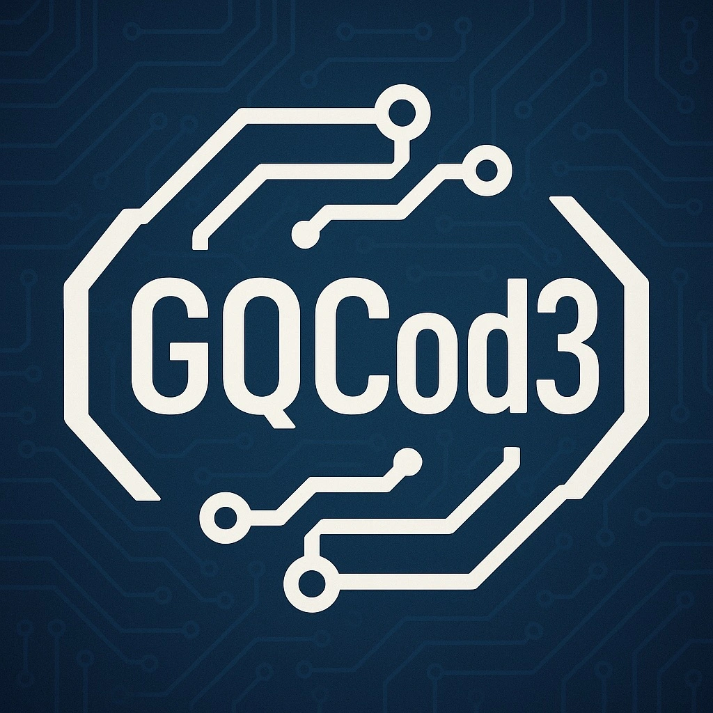

<h3>"Documentación de ShedOps"</h3>
<h3>Startup: GQ Technology</h3>
<h3>Producto: ShedOps</h3>

<h3>Equipo de Desarrollo:</h3>
<table>
    <tr>
        <th>Nombre</th>
        <th>Email</th>
    </tr>
    <tr>
        <td>Zavala Quedena, Gonzalo Andre</td>
        <td>gonzalo.qu3dena@outlook.com</td>
    </tr>
</table>

## Version History

<table>
    <tr>
        <th>Versión</th>
        <th>Fecha</th>
        <th>Autor</th>
        <th>Descripción</th>
    </tr>
    <tr>
        <td>0.1.0</td>
        <td>28/12/2025</td>
        <td>Zavala Quedena, Gonzalo Andre</td>
        <td align="justify">Actualización parcial del Capítulo I: se redactó la descripción de la startup (GQ Technology) y del producto ShedOps, se desarrollaron antecedentes y problemática, y se elaboraron las secciones Lean UX (Problem Statements, Assumptions y Canvas), además de la introducción y caracterización de los segmentos objetivo.</td>
    </tr>
    <tr>
        <td>0.2.0</td>
        <td>28/12/2025</td>
        <td>Zavala Quedena, Gonzalo Andre</td>
        <td align="justify">Actualización del Capítulo I: se incorporaron los Hypothesis Statements del proyecto bajo el enfoque Lean UX, definiendo criterios de éxito para validar el MVP.</td>
    </tr>
    <tr>
        <td>[Version]</td>
        <td>[Date]</td>
        <td>[Author]</td>
        <td>[Description]</td>
    </tr>
</table>

## Tabla de Contenido

### [Capítulo I: Introducción](#capítulo-i-introducción)

**[1.1. Startup Profile](#11-startup-profile)**  
[1.1.1. Descripción de la Startup](#111-descripción-de-la-startup)  
[1.1.2. Perfiles de integrantes del equipo](#112-perfiles-de-integrantes-del-equipo)

**[1.2. Solution Profile](#12-solution-profile)**  
[1.2.1. Antecedentes y problemática](#121-antecedentes-y-problemática)  
[1.2.2. Lean UX Process](#122-lean-ux-process)  
&emsp;[1.2.2.1. Lean UX Problem Statements](#1221-lean-ux-problem-statements)  
&emsp;[1.2.2.2. Lean UX Assumptions](#1222-lean-ux-assumptions)  
&emsp;[1.2.2.3. Lean UX Hypothesis Statements](#1223-lean-ux-hypothesis-statements)  
&emsp;[1.2.2.4. Lean UX Canvas](#1224-lean-ux-canvas)

**[1.3. Segmentos Objetivos](#13-segmentos-objetivos)**

# Capítulo I: Introducción

## 1.1. Startup Profile

### 1.1.1. Descripción de la Startup

<b>GQ Technology</b> es una startup enfocada al diseño y construcción de soluciones de software end-to-end, con una orientación marcada hacia el 
desarrollo <b>full Stack</b> y la <b>arquitectura de software</b>. Su propósito es transformar necesidades operativas de negocios y organizaciones en
productos digitales mantenibles, escalables y listos para evolucionar mediante buenas prácticas de ingeniería de software.

<b>Enfoque técnico y metodología:</b>

La startup se especializa en la implementación de productos con criterios de calidad técnica, destacando:

<ul>
  <li align="justify">
    <b>Desarrollo Full-Stack:</b> Construcción integral de aplicaciones web, cubriendo tanto interfaces de usuario como lógica de negocio y persistencia
    de datos, con integración completa entre frontend y backend.
  </li>
  <li align="justify">
    <b>DDD (Domain-Driven Design):</b> modelado del dominio como núcleo del producto, promoviendo un lenguaje ubicuo, límites claros (bounded contexts cuando aplique) y una estructura de código alineada a reglas de negocio, favoreciendo mantenibilidad y evolución.
  </li>
  <li align="justify">
    <b>Enfoque incremental:</b> construcción por MVP y entregas iterativas, priorizando valor temprano, validación funcional y refinamiento progresivo.
  </li>
</ul>

### 1.1.2. Perfil del Desarrollador

<table width="100%">
  <tr>
    <td align="center" valign="middle" width="250">
      
    </td>
    <td valign="middle" width="200">
      

        <strong style="font-size: 1.1em;">Zavala Quedena, Gonzalo Andre</strong>
      

    </td>
    <td valign="middle" width="180">
      

        Ingeniería de Software
      

    </td>
    <td valign="middle" width="400">
      

        Estudiante de Ingeniería de Software en la Universidad Peruana de Ciencias Aplicadas (UPC),
        con una profunda pasión por la tecnología y un firme compromiso con el aprendizaje continuo.
        Me especializo en el desarrollo de aplicaciones modernas, seguras y escalables, integrando
        frameworks y herramientas que impulsan la innovación en el campo del software.
        Busco constantemente nuevos retos que fortalezcan mis habilidades técnicas y mi crecimiento profesional.
      

    </td>
    <td valign="top" width="250">
      
<strong>Lenguajes</strong>

      

        
        
        
        
        
        
        
        
        
        
      

      
<strong>Frameworks</strong>

      

        
        
        
        
        
        
        
      

      
<strong>Herramientas</strong>

      

        
        
        
        
        
      

    </td>
  </tr>
</table>

## 1.2. Solution Profile

### 1.2.1. Antecedentes y Problemática

<b>Antecedentes</b>

Una gran cantidad de pequeños negocios de servicios administra sus reservas mediante canales informales y herramientas aisladas (por ejemplo, coordinación por mensajería y registro manual en hojas de cálculo). Esta práctica incrementa la probabilidad de inconsistencias operativas: reservas que se duplican, cancelaciones desordenadas y baja visibilidad de la agenda por miembro del staff.

<b>Problemática</b>

La gestión de reservas basada en mensajería (p. ej., WhatsApp) y hojas de cálculo (p. ej., Excel) genera conflictos, recordatorios omitidos, cancelaciones difíciles de rastrear y limitada visibilidad operativa del negocio y su personal.

<b>Problem Statement (5W's y 2H's)</b>

  <b>Who (¿Quiénes se ven afectados?)</b>
  <ul>
    <li>Administradores/dueños que necesitan control total del negocio (servicios, staff, agenda).</li>
    <li>Personal (staff) que requiere ver y gestionar su agenda sin conflictos ni ambigüedades.</li>
    <li>Clientes, indirectamente, por errores en confirmaciones, reprogramaciones y recordatorios.</li>
  </ul>

  <b>What (¿Qué ocurre exactamente?)</b>
  <ul>
    <li>
      Dobles reservas por falta de validación automática de solapamientos. 
    </li>
    <li>
      Recordatorios fallidos/omitidos por no existir un mecanismo sistemático.
    </li>
    <li>
      Cambios no auditables (quién movió/canceló) y "desorden" en cancelaciones o reprogramaciones. 
    </li>
  </ul>

  <b>Where (¿Dónde sucede?)</b>
  

  En la operación diaria del negocio (recepción/administración) y en la coordinación del personal, especialmente cuando hay múltiples colaboradores y alta rotación de citas.
  

  <b>When (¿Cuándo sucede?)</b>
  

  Principalmente en horas pico, al crear/modificar reservas rápidamente, y cuando hay cambios de último minuto (reprogramaciones/cancelaciones).
  

  <b>Why (¿Por qué sucede?)</b>
  

  Porque las herramientas actuales no garantizan consistencia: no aplican reglas de disponibilidad/horario ni bloqueos, y no previenen conflictos al nivel del sistema (API).
  

  <b>How (¿Cómo se manifiesta y cómo se pretende atender?)</b>
  <ul align="justify">
    <li>
      Se manifiesta como conflictos, pérdida de información y baja visibilidad.
    </li>
    <li>
      Se atiende con una plataforma centralizada con: calendario día/semana, reglas de disponibilidad y bloqueo, y prevención de solapamiento a nivel de API; además de control por roles y aislamiento por negocio (multi-tenant).
    </li>
  </ul>

  <b>How much (¿Cuánto impacta?)</b>
  

  Impacto cualitativo directo en eficiencia (tiempo administrativo), calidad del servicio (errores de agenda) y experiencia del cliente (cambios/recordatorios). Para el MVP, el foco es demostrar reducción de conflictos y mejora de control mediante reglas determinísticas y trazabilidad mínima.
  

### 1.2.2. Lean UX Process

En esta sección se aplica el enfoque Lean UX para aterrizar el dominio del problema y vincularlo con una solución MVP verificable. Para <b>ShedOps</b>, el
foco del proceso se centra en validar si una plataforma web de reservas con reglas de disponibilidad, prevención de conflictos y trazabilidad mínima reduce
fricción operativa frente al uso de WhatsApp y hojas de cálculo.

#### 1.2.2.1. Lean UX Problem Statements

  <b>Domain</b>
  

  El proyecto se enmarca en la gestión inteligente de reservas y operaciones básicas para negocios de servicios “por cita”, dentro del sector de software empresarial (SaaS) orientado a micro y pequeñas empresas. ShedOps centraliza agenda, clientes y servicios, incorporando reglas de disponibilidad, prevención de solapamientos y control por roles para reducir fricción operativa y mejorar la coordinación del personal.
  

  <b>Customer Segments</b>
  <ul>
    <li align="justify">
      <b>Dueños / Administradores (Admin)</b> de negocios de servicios (barberías, salones, clínicas pequeñas, talleres, entrenadores, centros estéticos): necesitan controlar agenda, staff, servicios y clientes desde un solo sistema.
    </li>
    <li align="justify">
      <b>Personal operativo (Staff)</b>: requiere una agenda confiable y actualizada para ejecutar reservas, reprogramaciones, reasignaciones y cancelaciones sin generar conflictos.
    </li>
    <li align="justify">
      Negocios con crecimiento operativo (más de 1 colaborador o alta rotación de citas): sufren mayor impacto por desorden de reservas y falta de reglas automatizadas.
    </li>
  </ul>

  <b>Pain Points</b>
  <ul>
    <li align="justify">
      <b>Dobles reservas y solapamientos:</b> por registrar citas en canales informales (mensajería) o herramientas no diseñadas para control de disponibilidad por staff.
    </li>
    <li align="justify">
      <b>Baja visibilidad del calendario:</b> el negocio y el staff no comparten una “fuente única de verdad” sobre la agenda.
    </li>
    <li align="justify">
      <b>Reprogramaciones/cancelaciones desordenadas:</b> sin trazabilidad mínima (qué cambió, cuándo, quién lo realizó).
    </li>
    <li align="justify">
      <b>Recordatorios inconsistentes:</b> que aumentan olvidos, atrasos o falta de confirmación.
    </li>
    <li align="justify">
      <b>Datos fragmentados:</b> (clientes, servicios y agenda separados), lo que incrementa trabajo manual y errores.
    </li>
  </ul>

  <b>Gap</b>
  <ul>
    <li align="justify">
      <b>La operación basada en WhatsApp/Excel</b> no aplica reglas automáticas de disponibilidad ni impide conflictos en el momento de agendar.
    </li>
    <li align="justify">
      <b>Herramientas genéricas (calendarios comunes):</b> no suelen incorporar flujo de reservas orientado a negocio, roles, restricciones por servicio/staff y trazabilidad operativa.
    </li>
    <li align="justify">
      No existe una plataforma simple, centrada en el negocio pequeño, que unifique clientes + servicios + agenda, con reglas consistentes y enfoque SaaS (aislamiento por negocio / multi-tenant).
    </li>
  </ul>

  <b>Vision / Strategy</b>
  <ul>
    <li align="justify">
      <b>Visión:</b> Convertir a ShedOps en una plataforma confiable y ligera para la gestión de reservas y operación básica en negocios de servicios, reduciendo fricción y mejorando el control del día a día.
    </li>
    <li align="justify">
      <b>Estrategia:</b>
      <ul>
        <li>
          Lanzar un MVP web con el núcleo de valor: agenda día/semana, reglas de disponibilidad y bloqueo, prevención de solapamientos y RBAC (Admin/Staff).
        </li>
        <li>
          Validar adopción y utilidad con negocios reales o escenarios representativos (piloto), antes de incorporar integraciones avanzadas (notificaciones reales, pagos, sincronización externa).
        </li>
      </ul>
    </li>
  </ul>

  <b>Initial Segment</b>
  <ul>
    <li align="justify">
      <b>Administradores:</b> que requieren implementar rápidamente un sistema de agenda sin complejidad de ERP, y <b>staff</b> que necesita una agenda clara para operar sin conflictos.
    </li>
    <li align="justify">
      <b> Negocios urbanos de servicios por cita</b>, con 1 a 10 colaboradores, que gestionan reservas diariamente y actualmente dependen de WhatsApp y/o hojas de cálculo.
    </li>
  </ul>

#### 1.2.2.2. Lean UX Assumptions

  <b>Business Assumptions</b>
  <ol>
    <li align="justify">
      Existe una necesidad real en micro y pequeñas empresas de servicios por adoptar una herramienta formal de reservas que reduzca errores y mejore la coordinación.
    </li>
    <li align="justify">
      Los negocios están dispuestos a migrar desde WhatsApp/Excel si la solución es simple de configurar y demuestra valor rápido (prevención de conflictos, control de agenda).
    </li>
    <li align="justify">
      Un MVP centrado en agenda + clientes + servicios es suficiente para validar el producto antes de incluir pagos, facturación o integraciones externas.
    </li>
    <li align="justify">
      El enfoque SaaS (multi-tenant) habilita escalabilidad comercial futura sin rediseñar la base del sistema.
    </li>
  </ol>

  <b>User Assumptions</b>
  <ol>
    <li align="justify">
      Los Admin valoran principalmente: control de horarios, gestión del staff, trazabilidad mínima y visibilidad completa de la agenda.
    </li>
    <li align="justify">
      El Staff requiere una vista rápida (día/semana) y operaciones directas sobre reservas (crear, reprogramar, reasignar, cancelar) sin pasos innecesarios.
    </li>
    <li align="justify">
      Los usuarios perciben “doble reserva” como el error más costoso y esperarán que el sistema lo prevenga automáticamente.
    </li>
    <li align="justify">
      Una experiencia clara y consistente en web (y adaptable a móvil) incrementará adopción, especialmente en operación diaria.
    </li>
  </ol>

  <b>Business Outcome Assumptions</b>
  <ol>
    <li align="justify">
      Implementar ShedOps reducirá incidentes de doble reserva y conflictos operativos, mejorando la confiabilidad del negocio frente al cliente.
    </li>
    <li align="justify">
      El negocio disminuirá el tiempo administrativo dedicado a coordinación manual (mensajes, confirmaciones dispersas, correcciones).
    </li>
    <li align="justify">
      Una agenda más ordenada y visible permitirá mejor utilización de disponibilidad del staff (menos huecos evitables por descoordinación).
    </li>
    <li align="justify">
      Una operación más controlada incrementará retención del negocio (baja intención de volver a herramientas informales).
    </li>
  </ol>

  <b>User Outcome Assumptions</b>
  <ol>
    <li align="justify">
      Los Admin se sentirán con mayor control y confianza al gestionar cambios y cancelaciones con trazabilidad mínima dentro del sistema.
    </li>
    <li align="justify">
      El Staff reducirá estrés operativo al tener una agenda clara y reglas que eviten conflictos automáticamente.
    </li>
    <li align="justify">
      Los usuarios percibirán mejora en productividad al centralizar clientes, servicios y reservas en una sola plataforma.
    </li>
    <li align="justify">
      La consistencia del flujo de recordatorios (aunque sea simulado en el MVP) aumentará la percepción de orden y profesionalismo del proceso.
    </li>
  </ol>

#### 1.2.2.3. Lean UX Hypothesis Statements

A continuación, se formulan las hipótesis del proyecto bajo el enfoque Lean UX. Cada hipótesis establece una creencia sobre el comportamiento o la adopción esperada de los usuarios frente a <b>ShedOps</b>, y define un criterio observable que permitirá validar si la solución propuesta está generando valor. Estas hipótesis orientan el diseño del MVP y delimitan qué evidencia debe recolectarse durante pruebas piloto para confirmar o refutar los supuestos del equipo.

  <b>Hipótesis 1</b>
  
 <b>Creemos que</b> los administradores (Admin) adoptarán ShedOps si les ofrecemos un sistema de agenda centralizado que prevenga automáticamente los solapamientos y permita gestionar disponibilidad y bloqueos de manera clara. 
 
 <b>Sabremos que</b> hemos tenido éxito cuando durante el primer mes de uso piloto al menos el 70% de las reservas se registren y gestionen completamente dentro de ShedOps (sin depender de WhatsApp/Excel) y los intentos de solapamiento sean rechazados por el sistema, manteniendo los incidentes de doble reserva cercanos a cero. 

  <b>Hipótesis 2</b>
  
 <b>Creemos que</b> el personal operativo (Staff) percibirá valor en ShedOps si la plataforma les permite visualizar su agenda en una vista Día/Semana y ejecutar acciones clave (crear, reprogramar, reasignar y cancelar reservas) de forma rápida y sin ambigüedades. 
 
 <b>Sabremos que</b> hemos tenido éxito cuando al menos el 80% del Staff complete las tareas clave sin ayuda externa en la primera semana de uso y el tiempo promedio para reprogramar o cancelar una reserva se reduzca entre 20% y 30% frente al proceso actual. 

  <b>Hipótesis 3</b>
  
 <b>Creemos que</b> la trazabilidad mínima de cambios (quién realizó el cambio y cuándo) incrementará la confianza operativa del Admin y reducirá la necesidad de validaciones manuales o revisiones en chats. 
 
 <b>Sabremos que</b> hemos tenido éxito cuando en al menos el 80% de los casos de reprogramación, reasignación o cancelación, el Admin pueda identificar responsable y momento del cambio directamente en la plataforma, sin recurrir a registros externos.

  <b>Hipótesis 4</b>
  
 <b>Creemos que</b> incorporar el flujo de recordatorios (aunque sea simulado en el MVP) aumentará la percepción de orden del proceso y facilitará el seguimiento administrativo de las reservas. 
 
 <b>Sabremos que</b> hemos tenido éxito cuando al menos el 85% de los usuarios (Admin y Staff) califique positivamente (CSAT ≥ 85%) la dimensión de “organización y seguimiento”, y más del 70% de las reservas cuente con un registro de recordatorio generado y consultable dentro del sistema. 

  <b>Hipótesis 5</b>
  
 <b>Creemos que</b> un modelo multi-tenant con control por roles (RBAC) reducirá riesgos de acceso indebido y sentará una base sólida para la escalabilidad del producto sin introducir complejidad innecesaria al usuario final. 
 
 <b>Sabremos que</b> hemos tenido éxito cuando se verifique, mediante pruebas funcionales, que un usuario no puede acceder ni modificar información de otro negocio (tenant) y que al menos el 90% de las acciones restringidas por rol (Admin/Staff) se bloqueen correctamente cuando corresponda. 

 <b>Creemos que</b> un modelo multi-tenant con control por roles (RBAC) reducirá riesgos de acceso indebido y sentará una base sólida para la escalabilidad del producto sin introducir complejidad innecesaria al usuario final. 
 
 <b>Sabremos que</b> hemos tenido éxito cuando se verifique, mediante pruebas funcionales, que un usuario no puede acceder ni modificar información de otro negocio (tenant) y que al menos el 90% de las acciones restringidas por rol (Admin/Staff) se bloqueen correctamente cuando corresponda. 

#### 1.2.2.4. Lean UX Canvas

El Lean UX Canvas es una herramienta que permite sintetizar, en una sola vista, los elementos clave de la iniciativa y las suposiciones que la sustentan. A través de este canvas, el equipo define el problema de negocio, los usuarios objetivo, las soluciones propuestas y los resultados esperados, estableciendo hipótesis que luego deben validarse con evidencia. Su objetivo es alinear criterios entre los integrantes, reducir ambigüedades y priorizar el aprendizaje, asegurando que las decisiones de diseño y desarrollo del MVP se basen en supuestos explícitos y medibles.

<table style="width: 100%; border-collapse: collapse;">
  <tr>
    <td style="border: 1px solid black; text-align: justify; padding: 8px; vertical-align: top;">
      <strong>1. Business Problem</strong>
      

        Los micro y pequeños negocios de servicios que gestionan citas con WhatsApp/Excel sufren dobles reservas,
        reprogramaciones/cancelaciones desordenadas, baja visibilidad del calendario y poca trazabilidad de cambios,
        lo que incrementa la fricción operativa y deteriora la experiencia del cliente.
      

    </td>
    <td style="border: 1px solid black; text-align: justify; padding: 8px; vertical-align: top;" rowspan="2">
      <strong>5. Solutions</strong>
      

        ShedOps proporciona una plataforma web (MVP) de gestión de reservas que centraliza clientes, servicios y agenda,
        incorporando reglas de disponibilidad (por negocio y por staff), bloqueos (breaks/time off), prevención de solapamientos
        a nivel de sistema, control por roles (Admin/Staff), y trazabilidad mínima de cambios. Incluye recordatorios simulados
        (registro/log) para validar el flujo antes de integrar proveedores reales.
      

    </td>
    <td style="border: 1px solid black; text-align: justify; padding: 8px; vertical-align: top;">
      <strong>2. Business Outcomes</strong>
      

        En una prueba piloto (4–8 semanas) con 2–3 negocios: reducir a ~0 los incidentes de doble reserva causados por solapamiento
        (por rechazo de la regla), disminuir en 20–30% el tiempo administrativo para crear/reprogramar/cancelar reservas,
        y alcanzar un índice de satisfacción (CSAT) ≥ 85% en Admin y Staff. Adicionalmente, lograr que al menos 70% de reservas
        se gestionen completamente dentro de ShedOps (sin “doble registro” fuera del sistema) durante el piloto.
      

    </td>
  </tr>
  <tr>
    <td style="border: 1px solid black; text-align: justify; padding: 8px; vertical-align: top;">
      <strong>3. Users</strong>
      
Nuestros usuarios incluyen:

      <ul style="padding-left: 18px; margin: 0;">
        <li>
          <strong>Admin (dueño/encargado)</strong> que requiere control de la operación: configuración de servicios,
          horarios, bloqueos, usuarios, y visibilidad completa de la agenda.
        </li>
        <li>
          <strong>Staff (personal operativo)</strong> que necesita una agenda confiable para crear y gestionar reservas
          (reprogramar, reasignar, cancelar) sin conflictos.
        </li>
      </ul>
    </td>
    <td style="border: 1px solid black; text-align: justify; padding: 8px; vertical-align: top;">
      <strong>4. User Outcomes &amp; Benefits</strong>
      
Esperamos que nuestros usuarios logren:

      

        <b>Admin:</b> Mayor control y orden operativo, con visibilidad centralizada y trazabilidad mínima de cambios
        (qué cambió, cuándo y quién), reduciendo coordinación manual.  
        <b>Staff:</b> Menos fricción al operar el día a día, con prevención automática de solapamientos, reglas claras de disponibilidad
        y una vista de calendario actualizada para ejecutar cambios con confianza.
      

    </td>
  </tr>

  <tr>
    <td style="border: 1px solid black; text-align: justify; padding: 8px; vertical-align: top;">
      <strong>6. Hypotheses</strong>
      

        <em>Si</em> el sistema aplica validación de no-solapamiento y disponibilidad (horarios + bloqueos) al crear o editar reservas,
        <em>entonces</em> los incidentes de doble reserva tenderán a 0 durante el piloto.
      

      

        <em>Si</em> Admin y Staff cuentan con vista Día/Semana y un flujo directo para crear/reprogramar/reasignar/cancelar,
        <em>entonces</em> el tiempo promedio de gestión de una reserva se reducirá en 20–30% versus el método actual.
      

      

        <em>Si</em> el control por roles (Admin/Staff) se alinea a las tareas reales de cada usuario,
        <em>entonces</em> al menos 80% de los usuarios completará sus tareas clave sin ayuda externa en la primera semana de uso.
      

      

        <em>Si</em> se registra trazabilidad mínima (created/updated by + timestamps y/o historial ligero),
        <em>entonces</em> el Admin podrá responder preguntas operativas (quién cambió qué y cuándo) sin revisar chats o hojas externas
        en la mayoría de casos (≥ 80%).
      

      

        <em>Si</em> el flujo de recordatorios (simulado) queda integrado a la reserva con estados/logs consultables,
        <em>entonces</em> los usuarios percibirán mayor orden y control del proceso, reflejado en CSAT ≥ 85% en la dimensión
        “organización y seguimiento”.
      

    </td>
    <td align="justify" style="border: 1px solid black; text-align: justify; padding: 8px; vertical-align: top;">
      <strong>7. ¿What's the most important thing we need to learn first?</strong>
      

       Validar si ShedOps resuelve el dolor principal del negocio: que Admin y Staff adopten la plataforma como la “fuente única de verdad” para gestionar la agenda, confiando en la prevención de solapamientos y en las reglas de disponibilidad, en lugar de seguir coordinando y registrando reservas en WhatsApp o Excel.
      

    </td>
    <td align="justify" style="border: 1px solid black; text-align: justify; padding: 8px; vertical-align: top;">
      <strong>8. What's the least amount of work we need to do to learn the next most important thing?</strong>
      

      Implementar un MVP funcional con:
      

      <ol>
          <li>
            Creación/edición/cancelación de reservas,
          </li>
          <li>
            Validación de solapamientos,
          </li>
          <li>
            Horarios + bloqueos,
          </li>
          <li>
            Roles Admin/Staff y vista Día/Semana.
          </li>
        </ol>
        

        Probarlo con 2–3 negocios piloto durante 2 semanas, midiendo: intentos de solapamiento rechazados, tiempo por operación (crear/reprogramar/cancelar), y una encuesta corta de CSAT.
        

    </td>
  </tr>
</table>

## 1.3. Segmentos Objetivos

Para que ShedOps genere valor real en la operación diaria de los negocios de servicios y alcance una adopción efectiva, es fundamental identificar con claridad los segmentos de usuarios a los que está dirigida la solución. A continuación, se presentan los perfiles de los usuarios objetivo, considerando sus características geográficas, psicográficas y demográficas, con el fin de delimitar el enfoque del MVP y orientar adecuadamente el diseño del producto.

<table style="width:100%; border-collapse: collapse; text-align: center;">
  <thead>
    <tr>
      <th style="border: 1px solid black; padding: 8px;">Tipo de usuario</th>
      <th style="border: 1px solid black; padding: 8px;">Geográfico</th>
      <th style="border: 1px solid black; padding: 8px;">Psicográfico</th>
      <th style="border: 1px solid black; padding: 8px;">Demográfico</th>
    </tr>
  </thead>

  <tbody>
    <tr>
      <td style="border: 1px solid black; padding: 8px;">
        <strong>Admin  (dueño/encargado del negocio de servicios)</strong>
      </td>
      <td style="border: 1px solid black; padding: 8px;" align="justify">
        Principalmente en zonas urbanas y metropolitanas del Perú, donde existe mayor concentración de micro y pequeñas
        empresas de comercio y servicios y una alta rotación de atención “por cita” (barberías, salones, centros estéticos,
        consultorios, talleres de servicios, entrenadores, etc.).
      </td>
      <td style="border: 1px solid black; padding: 8px;" align="justify">
        Priorizan el orden operativo y la reducción de errores (dobles reservas y confusiones en reprogramaciones).
        Valoran herramientas simples que les den control y visibilidad de la agenda, con reglas claras (disponibilidad,
        bloqueos) y trazabilidad básica de cambios. Buscan profesionalizar el proceso sin adoptar sistemas complejos.
      </td>
      <td style="border: 1px solid black; padding: 8px;" align="justify">
        <ul style="margin: 0; padding-left: 18px;">
          <li><strong>Edad:</strong> 25 a 55 años</li>
          <li><strong>Educación:</strong> Variable; desde formación técnica hasta universitaria</li>
          <li><strong>Ocupación:</strong> Dueño, administrador o encargado de operaciones de un negocio de servicios</li>
          <li><strong>Tamaño típico del negocio:</strong> 1 a 10 colaboradores (micro y pequeña empresa)</li>
        </ul>
        

          <em>Sustento:</em> En el Perú, las micro y pequeñas empresas concentran más del 99% del tejido empresarial formal.
          Además, una gran proporción de estas empresas se ubica en actividades de comercio y servicios, lo que respalda el enfoque
          en negocios pequeños con operación diaria orientada a atención al cliente.
        

      </td>
    </tr>
    <tr>
      <td style="border: 1px solid black; padding: 8px;">
        <strong>Staff  (personal operativo / colaboradores que atienden servicios)</strong>
      </td>
      <td style="border: 1px solid black; padding: 8px;" align="justify">
        Zonas urbanas del Perú donde los servicios se prestan por turnos y se requiere coordinación constante de agenda
        (distritos comerciales, zonas de alta demanda, áreas con concentración de servicios personales o de salud).
      </td>
      <td style="border: 1px solid black; padding: 8px;" align="justify">
        Enfocados en la ejecución diaria: necesitan claridad y rapidez para atender sin interrupciones. Valoran una agenda
        confiable, actualizada y fácil de usar, que reduzca fricción (menos mensajes de coordinación) y evite conflictos
        (no solapamientos). Prefieren flujos simples y consistentes para reprogramar, reasignar o cancelar.
      </td>
      <td style="border: 1px solid black; padding: 8px;" align="justify">
        <ul style="margin: 0; padding-left: 18px;">
          <li><strong>Edad:</strong> 18 a 45 años</li>
          <li><strong>Educación:</strong> Secundaria, técnica o formación especializada según el servicio (estética, salud, entrenamiento, etc.)</li>
          <li><strong>Ocupación:</strong> Colaborador que presta el servicio (barbero/estilista/técnico/terapeuta/entrenador/asistente)</li>
          <li><strong>Entorno laboral:</strong> Principalmente micro y pequeñas empresas con agendas dinámicas y cambios frecuentes</li>
        </ul>
        

          <em>Sustento:</em> El empleo privado se concentra en gran medida en unidades de menor tamaño (mipyme), por lo que es esperable
          que el usuario “staff” opere en organizaciones pequeñas donde los procesos suelen ser más informales y la coordinación de turnos
          depende de herramientas simples.
        

      </td>
    </tr>
  </tbody>
</table>
